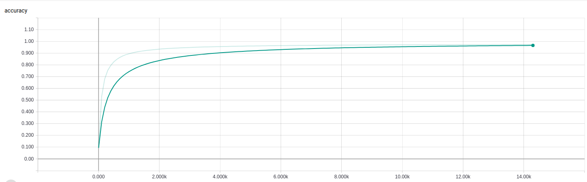
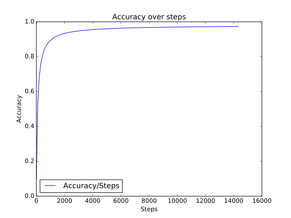
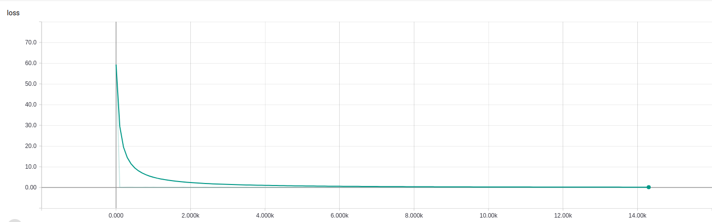

# Classification of HTRU2 Data Set
This is an exploration into using TensorFlow to classify a data set.

## Data Set
The data set can be found [here](https://archive.ics.uci.edu/ml/datasets/HTRU2 "UCI Machine Learning Repository"). 
It includes 17,898 records with 1,639 real pulsar examples and 16,259 negative examples caused by interference/noise.
There are eight continuous variables and a binary class variable.

## Goals
- [x] Determine data set
- [x] Build TensorFlow from source
- [x] Classify data set
- [x] Explore alternative classification techniques
- [x] Write paper about methods tested

## Paper
The paper will be written to [NIPS standards](https://nips.cc/Conferences/2017/PaperInformation/StyleFiles), utilizing [nips_2017.sty](https://media.nips.cc/Conferences/NIPS2017/Styles/nips_2017.sty).

## Results
Accuracy of training data is over 97%.

Loss function approaches zero very quickly.

## Build
To utilize this repository you will need the following:
- [TensorFlow](https://www.tensorflow.org/)
- [Pandas](http://pandas.pydata.org/)
- [scikit-learn](http://scikit-learn.org/stable/)
After installing those you will be able to run `main.py`. If you wish to see my 
results you can run `tensorboard --logdir model` from the main directory which 
will allow you to see all of the visualizations associated with this repository.